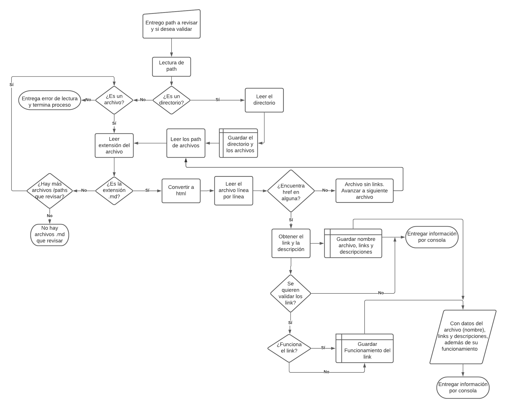

# Markdown Links - Valeria Argomedo

## Descripción 
Librería que permite leer y analizar archivos de formato markdown. En estos se verifica que haya links, además de entregar una lista de cada link encontrado. También se puede validar el status de cada link en los archivos y obtener la información por consola. 

## Version 
1.1.2

## Instalación

### **Local** 

```
npm install topitosnook-md-link
```
### **Global** 

```
npm install -g topitosnook-md-link
```

## Uso
### **API**

```js
const mdLinks = require(./mdLinks);
mdLinks(route, validation);
```
Donde:

  **route**: es la ruta del archivo o directorio a revisar.

  **validation**: booleano que determina si se desea validar o no los links

### **Command Line Interface (CLI)**

```
npx topitosnook-md-link <route> <option>
```
Donde:

  **route**: sigue siendo la ruta del archivo o directorio a revisar.

  **option**: 
  - indicar `--validate` para que se validen los links
  - vacío para que solo encuentre los links

### **Respuesta**
* `validation` = false
```
File: nombre del archivo
url: link encontrado
description: descripción asociada al link encontrado
```
* `validation` = true
```
File: nombre del archivo
url: link encontrado
description: descripción asociada al link encontrado
status: codigo http del status
status message: <Ok> o <Fail> dependiento del status del link
```
## Planificación y desarrollo
Se genero un diagrama de flujo para la guía y desarrollo de este proyecto.

